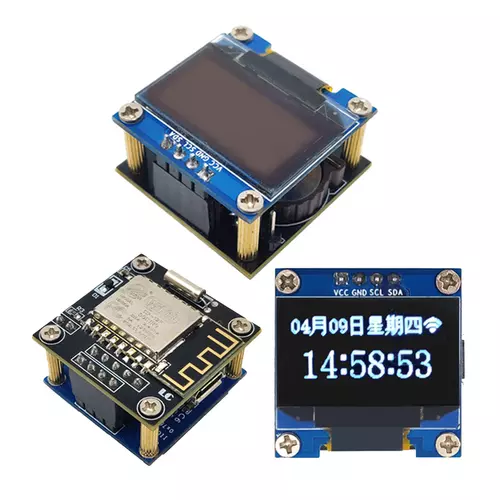

### ESP8266 0.96inch OLED Hello world application

This is a Hello World app for a module sold on eBay: "ESP8266 0.96inch OLED Clock Weather PM2.5 Calendar ESP-12F Development Board"

## Install

1. Install Arduino IDE.

2. File -> Preferences, add additional boards manager URL: http://arduino.esp8266.com/stable/package_esp8266com_index.json

3. Tools -> Manage libraries, install Adafuit Adafruit GFX Libary and Adafruit SSD1306

4. Tools -> Board -> esp8266 -> Node MCU 0.9 (ESP-12 Module)

5. Connect USB to RS232 3.3v module: GND -> GND, RxD -> TxD, TxD -> RxD. And connect IO0 to GND on the board, there is extra GND pin on the board.

6. Plug USB.

7. Build and upload.

8. Disconnect IO0, and unplug and replug USB to run the code.
